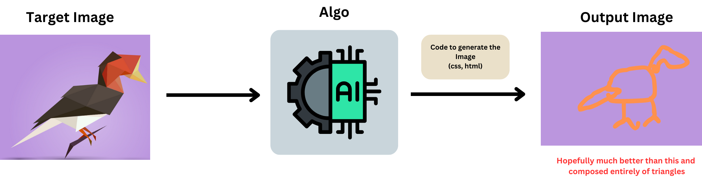

# 30 pieces project
The full project steps will be documented at [medium](https://medium.com/@jerryjohnthomas) soon.

## What?
Inspired by this site [30 species, 30 pieces](http://species-in-pieces.com/#). I was really fascinated by the 30 triangle pieces they used and created such beautiful art. Me being unartistic but good in coding thought why not try out different algo that can make similarly looking species, from just an image.

Eventually an Image if fed into the system, the model gives out the position of "n" triangles with colour so that we can replicate it.

Also the transition on the 30 piece website is too cool, will replicate that too. Then later with different with polygons with sides >3 and higher triangles. Everything in the graphics world is just triangles, so we are certainly not limited by the chosen polygon shape.

**THIS IS NOT A FILTER**. A filter is just add a matrix on top of the existing image, here we are trying to make a replication mechanism. 

## How?
I hope that we can start off with NEAT ALgo, move to RL algo's for replication, neural style transfer. 
Inspiration, I was once inspired by an youtube video attempting this on Mona Lisa in python, (ill put up reference if I find it)
**I need more ideas desperately 😊**

## Duration?
Always "Coding in Progress".  

## How you can contribute
Ill try to provide all the utility functions that are required soon, so that we can experiment on it
Either by Coding up Different Methods, or suggesting different things.

Follow the pattern.
1. Rough Theory: Create a some scribbling or detailed steps in .md file inside Methods (place all assets in the Assets folder)
2. Code it up: Each implementation in a different folder and you can add a route from the home page on to your root folder.

Fork this project, make your changes and raise a PR.

Add-ons:
* If you need help drawing basic diagrams, use Canva [draw](https://www.canva.com/design/DAFu_nxg-6w/8ijozYRZpn4Qm0l-BABxOw/edit?ui=eyJBIjp7IkIiOnsiQiI6dHJ1ZX19LCJFIjp7IkE_IjoiUCJ9LCJHIjp7IkIiOnRydWV9fQ)

## Website instructions
* `npm deploy` deploys it to Github pages - [here](https://jerryjohnthomas.github.io/30pieces/).

<!--  -->

<a href="https://media.tenor.com/cTNHiNckhfIAAAAC/minions-strong.gif">Minions Strong GIF</a> 